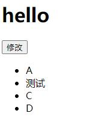
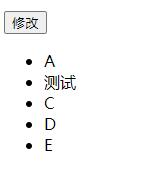
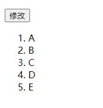

## 2021/5/12 学习虚拟 DOM 和 diff 算法

### diff 算法是发生在虚拟 DOM 上的

### h 函数用来生成虚拟节点

- h 函数的调用方式：

```js
h("a", { props: { herf: "http://www.baidu.com" } }, "内容");
```

- 将得到下面的节点：

```js
{ sel: "a", data: { props: { href: "http://www.baidu.com" } }, text: "内容" };
```

- 它表示真正的 DOM 节点：

```html
<a href="http://www.baidu.com">内容</a>
```

- 实际上虚拟节点中的内容有：

```js
  {
    children: undefined, // 子节点，undefined 表示没有子节点
    data: {}, // 属性样式等
    elm: undefined, // 该元素对应的真正的 DOM 节点，undefined 表示它还没有上树
    key: undefined, // 节点唯一标识
    sel: 'div', // selector 选择器 节点类型（现在它是一个 div）
    text: '我是一个盒子' // 文字
  }
```

- 将上面创建的虚拟节点使用 patch 函数上树

```js
// 创建patch函数,这些module是snabbdom中的内容
const patch = init([
  classModule,
  propsModule,
  styleModule,
  eventListenersModule,
]);

// 创建虚拟节点
const aNode = h("a", { props: { href: "http://www.baidu.com" } }, "百度");
console.log(aNode);

// 让虚拟节点上树
const container = document.querySelector("#container");
patch(container, aNode);
```

- 如果使用下面的虚拟节点：

```js
const boxNode = h("div", { class: { box: true } }, "我是一个盒子");
```

- 将得到下面的 DOM：

```html
<div class="box">我是一个盒子</div>
```

- 如果虚拟节点没有属性，就可以省略第二个参数

```js
const boxNode = h("div", "我是一个盒子");
```

### h 函数可以嵌套使用，从而得到虚拟 DOM 树（重要）

- h 函数可以这样使用

```js
h("ul", {}, [h("li", {}, "牛奶"), h("li", {}, "咖啡"), h("li", {}, "可乐")]);
```

- 得到下面的 DOM 树

```js
{
  "sel": "ul",
  "data": {},
  "children": [
    { "sel": "li", "data": {}, "text": "牛奶" },
    { "sel": "li", "data": {}, "text": "咖啡" },
    { "sel": "li", "data": {}, "text": "可乐" }
  ]
}
```

- 如果子元素只有一个，子元素参数就不用写成一个数组

```js
h("div", h("span", "hello"));
```

- 由此看来，h 函数的使用方法有多种
  > h('div')
  > h('div', '文字')
  > h('div', [])
  > h('div', h())
  > h('div', {}, '文字')
  > h('div', {}, [])
  > h('div', {}, h())

### 最小量更新

#### key 是最小量更新的唯一标识

- key 是最小量更新的唯一标识，告诉 diff 算法在更改前后哪些是同一节点

```js
const vnode1 = h("ul", {}, [
  h("li", { key="A" }, "A"),
  h("li", { key="B" }, "B"),
  h("li", { key="C" }, "C"),
  h("li", { key="D" }, "D"),
]);
const container = document.getElementById("container");
patch(container, vnode1);

const vnode2 = h("ul", {}, [
  h("li", { key="A" }, "A"),
  h("li", { key="B" }, "B"),
  h("li", { key="C" }, "C"),
  h("li", { key="D" }, "D"),
  h("li", { key="E" }, "E"),
]);

// 点击按钮时，将vnode1变为vnode2
const btn = document.getElementById("btn");
btn.onclick = function () {
  patch(vnode1, vnode2);
};
```

- 通过操作控制台将第二项内容改成“测试”，如下所示：
  </img>
- 点击修改按钮，发现增加了“E”项，但是“测试”没有发生变化，说明这是最小量更新的
  </img>
- 但是如果我们将修改数据的父节点类型改成 ol：

```js
const vnode2 = h("ol", {}, [
  h("li", { key="A" }, "A"),
  h("li", { key="B" }, "B"),
  h("li", { key="C" }, "C"),
  h("li", { key="D" }, "D"),
  h("li", { key="E" }, "E"),
]);
```

- 会发现“测试”被替换了，因为 diff 算法认定父节点 ul 和 ol 不是一个节点，所以会将原来 ul 中的内容拆除，渲染新的节点
  </img>

### 什么是同一节点

- 只有选择器相同并且 key 相同，才会被认为是同一节点
